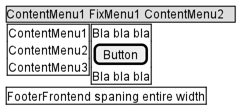

# Micro Frontend POC

## Objectives

Finding out how to create a microfrontend environment with the following
properties:

- Hosted on multiple URL's
- Single sign on on the frame
- Use BFF
- Dynamic menu structure (frontend parts will communicate to create a
  menu)
- Google tag manager per micro frontend page, but bootstrapped from the
  frame

## Definitions

- Micro frontend: a part of the system, having its own frontend, backend
  and lifecycle
- Frame: The main microfrontend as visited by the user, this one holds
  references to all other micro frontends

## Design

There are in total 5 microfrontends:

1. TopMenu: Contains and renders top menu items
2. LeftMenu: Contains and renders left menu items
3. Footer: Contains and renders the footer
4. Main: Contains the main content of the POC, has a button to do
   something with the api, and will send out signals to TopMenu and
   LeftMenu to add more menu items to their system
5. Frame: The frame will place the 4 previous systems as 1 whole on a
   single page and glue everything together.

## Architecture

### TopMenu

Renders it own menuitems (received from his api) and receives extra menu
items via a yet to be determined system. A sort by priority number will
determine the order everything will be rendered

### LeftMenu

Renders it own menuitems (received from his api) and receives extra menu
items via a yet to be determined system. A sort by priority number will
determine the order everything will be rendered

### Footer

Simple javascript without any inter-communication with other frontends

### Main

Renders a simple page, sends out signals to change menu items and has a
button that does a weather forecast.

### Frame

Handles logon, receives code from the 4 different microfrontends and
will glue everything together in a nice and clear way

## Frameworks
 
- React
- SingleSpa
- Dotnet Core 3.1

## Build & Deploy

Build and deploy are out of scope for the POC and will be done from
commandline / project. Infrastructure is contained in terraform files in
this project.
